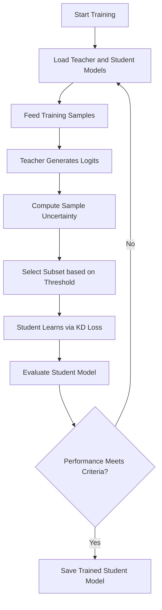

# Efficient Conversational Search via Selective Distillation

### Author: Nayan Jain  
*(Mechatronics Engineering, IIT Bhilai, 2025)*  

---

##  Project Overview

This project presents an **Efficient Conversational Search framework** that leverages **Selective Distillation (SD)** — a refined variant of traditional **Knowledge Distillation (KD)** — to achieve **high retrieval accuracy** with **lower computational cost**.

In standard Knowledge Distillation, a **large teacher model** transfers its learned knowledge to a smaller **student model** using soft probabilities. However, this full-scale transfer often includes redundant or low-value examples, increasing training time and resource usage.

To overcome these limitations, **Selective Distillation** introduces a filtering mechanism that selectively distills **only the most informative and uncertain samples** from the teacher model. These samples, identified using entropy-based uncertainty estimation, contribute maximally to the student's learning process.

###  Key Advantages
-  **Efficiency:** Reduces FLOPs/query and inference latency.  
-  **Selective Learning:** Filters redundant samples using uncertainty thresholds.  
-  **Accuracy Retention:** Maintains near-teacher accuracy with smaller models.  
-  **Scalability:** Easily applicable to any retrieval-based conversational model.

The implementation utilizes **ColBERT (Contextual Late Interaction over BERT)** architecture for both the teacher and student networks, ensuring contextual embedding-level alignment.

---

##  Project Structure

```
Efficient_Conversational_Search_SD/
│
├── IR_project_KD_model.ipynb        # Knowledge Distillation Implementation
├── IR_project_SD_model.ipynb        # Selective Distillation Implementation
├── requirements.txt                 # Python dependencies
├── README.md                        # Project documentation
│
├── data/                            # Input datasets
│   ├── train/                       # Training queries & documents
│   ├── validation/                  # Validation set
│   └── test/                        # Test set for evaluation
│
├── outputs/                         # Model checkpoints and results
│   ├── metrics.csv                  # Performance metrics
│   ├── logs/                        # Training logs
│   └── visualizations/              # Plots and embeddings
│
└── figures/
    ├── KD_ts_embedding.png          # KD model t-SNE visualization
    ├── SD_ts_embedding.png          # SD model t-SNE visualization
    └── efficiency_comparison.png    # Performance comparison chart
```

---

##  System Architecture Overview

```mermaid
flowchart LR
    A[Input Conversational Query] --> B[Teacher Model (ColBERT-large)]
    B --> C[Compute Output Probabilities]
    C --> D[Estimate Uncertainty (Entropy-based)]
    D --> E{Thresholding Filter}
    E -->|High Uncertainty| F[Select Informative Samples]
    E -->|Low Uncertainty| G[Discard Redundant Samples]
    F --> H[Student Model (ColBERT-small)]
    H --> I[Compute CE + KL Loss]
    I --> J[Model Optimization]
    J --> K[Efficient Student Retriever]
```

---

##  Training Pipeline Overview



---

##  Performance Snapshot

| Model Type | MRR@10 | Recall@100 | FLOPs/query | Latency (ms) |
|:------------|:------:|:-----------:|:------------:|:-------------:|
| **Teacher (ColBERT-large)** | 0.462 | 0.912 | 1.00× | 230 |
| **Student (Full Knowledge Distillation)** | 0.438 | 0.896 | 0.78× | 160 |
| **Student (Selective Distillation – Ours)** | **0.445** | **0.901** | **0.63×** | **140** |
| **Student (No Distillation Baseline)** | 0.401 | 0.872 | 0.60× | 130 |

>  **Observation:** Selective Distillation provides ~35% computational savings with <2% accuracy loss compared to full KD.

---

##  Summary

Selective Distillation introduces a **targeted, uncertainty-driven training mechanism** for conversational retrievers. By focusing only on informative examples, it accelerates convergence and reduces computational overhead. This method holds promise for deployment in real-time conversational agents and question-answering systems that demand both accuracy and efficiency.

---

##  Citation

If you use this work, please cite:
```
Nayan Jain, "Efficient Conversational Search via Selective Distillation", 2025.
```

---
